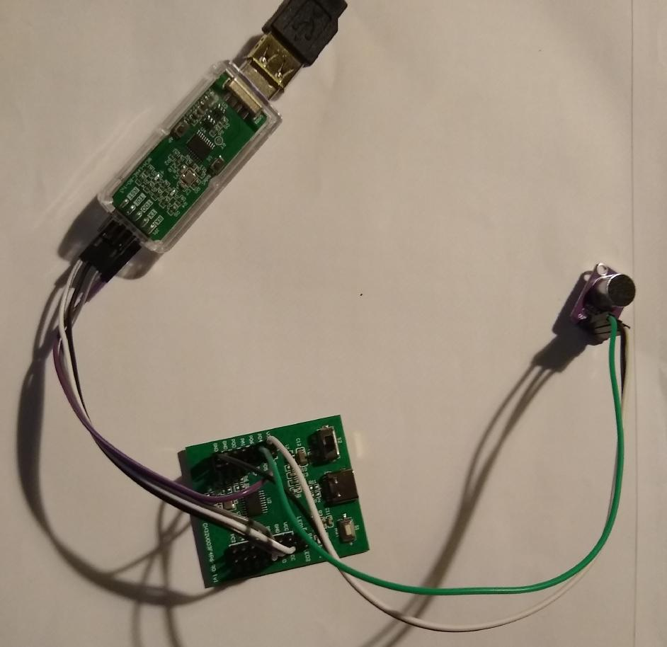

# Simple Speech-To-Text on the '10 cents' CH32V003 Microcontroller

This program will read audio from an analog microphone 
and distinguish between the spoken digits 'zero' to 'nine', 
logging the results over a serial link.

I use a MAX4466 electret microphone amplifier board connected to
a CH32V003 development board, along with a WCH-LinkE adaptor for both programming
the chip and acting as a UART-to-USB converter to read the output.

## Compiling

The code is based on the excellent [ch32v003fun](https://github.com/cnlohr/ch32v003fun)
library, and should be compiled in a similar way to the examples there.
(i.e. this directory should be added to the 'examples/' directory
alongside the others)

## Pin Connections

|Link-E Adaptor|CH32V003 Dev Board|
|  --- | --- |
| 3V3 | VCC |
| GND | GND |
| SWDIO/TMS | PD1 |
| RX | PD5 |
| --- | --- |
|MAX4466 Microphone|CH32V003 Dev Board|
| --- | --- |
|VCC | VCC |
| GND | GND |
| OUT | PD4 |

## Accuracy

I'm getting about 90% accuracy identifying spoken digits with the code
as it stands. As with all R&D, there's always scope for improvement.

## Training / Development

In training/ there is a stripped-down ch32v003 program to just dump
8-bit raw audio samples over the serial link, and a desktop-linux program
to read that data and do training of spoken words, simulating the
integer-pipeline used in the main code for the audio processing.

In misc/ are C programs that generate:
- the FFT 'twiddles' integer sin/cos tables used in the FFT function 
(twiddles_RES13.h)
- the FFT-to-Mel matrix, (mel_mx.h)
- the discrete-cosine-transform matrix  (dctm_20x8_8bit.h)
- the  codebook.h spoken-numbers codebook. (codebook.h)

## Challenges

- Only have 16K storage and 2K RAM available, not much room for lookup tables,
codebooks and matrices for processing. (the binary is currenty about 10K)

- The ADC on the CH32V003 is only 10-bit as opposed to the usual 16-bit
(or even 12-bit) minimum for good quality audio. 
This is compensated for somewhat  by 8x oversampling/averaging.
I can feed the sampled audio into the 'Whisper' STT application
and get accurate general transcription done, so the quality is certainly
'good enough'.

- No I2S support so using a higher-quality digital microphone is not an option.

- No floating-point support, all code must use integer/fixed-point math

- No hardware-multiply or hardware-divide - so audio processing routines have
to be lean and fast to run within the 48MHz / 100fps timing constraints

## How it works

The code uses traditional (allbeit pared down)  MFCC feature extraction,
and simply compares buffered tensors of samples against pre-recorded
spoken digits to get a 'best match'.

A timer is set up to generate an interrupt around 50,000/sec. On receiving
an interrupt, the ADC is read and the next sample convertion started.
8 consecutive samples are averaged to generate a ~6400 samples/sec audio stream.

Every 64 samples (10ms), a 128-wide FFT of a buffer of the last 128 samples is
performed and 20 mel-scale frequency bins are calculated from that. The
mel bin energies  are converted to log2-scale.
Finally an 8-bin cepstrum is calculated via a DCT of the 20 log-mel bins.

When the 'energy' of a frame (sum of all mel levels) is above a threshold, it is added to a 'word'
buffer, otherwise a count of 'silence' frames is increased.

When enough 'silence' frames have passed to signify the end of a spoken
sample, its length is warped to exactly 16 frames and compared to a
lookup table of previously stored word samples, and the closest match 
is reported.

## How it compares to more common speech-to-text systems

- Usually 16,000 samples/sec audio is used (high fidelity), however to
reduce the audio processing required, only 6400 samples/sec audio is used here. 
This is still high enough quality for accurate transcription 
(the top speech formants are at around 3200Hz, everything above that is redundant
in terms of recognition). 
This makes each 10ms slice of audio exactly 64 samples.

- Heavy pre-emphasis used (1.0 i.e. subtract the previous sample from 
the current one. This mostly removes spectral tilt, and completely removes
any DC level in the signal.

- 20ms frames are used, compared to 25ms found elsewhere (Vosk,Whisper).  Standard 10ms
step/100fps processing is maintained though. This allows for 128-sample FFT
to be used - FFT alogrithm is optimal at power-of-2 widths, and potentially would
allow for 100% faster FFT by taking advantage of the symmetry of the algo.
 The narrow-framesize is compensated for by:

- no windowing used. Usually the signal has a Hann window applied to  the signal before FFT, this step is skipped to avoid 'bookending' the  narrow signal.
Not windowing raises the noise-floor of the FFT output, but noise-floor removal
of the output mel bins is done to compensate.

- Only 20 mel bins calculated. Usually 40 (Vosk) or even 80 mel-scale bins
(Whisper) are used these days.

- extreme (probably overly so) compression via DCT to 8 cepstrum bins to
minimise the final frame dimensions.

## Applications

Maybe the basis for a low-complexity/low-power/low-cost/always-on wakeword engine?

## Future
New versions of the CH32 line of chips is due soon, improving the ADC to 12-bit and adding hardware-multiply instructions which would speed up the FFT and
matrix-multiply routines in the code significantly, and improve
accuracy in the processing.

## Why? 

I dunno, I like a challenge. :grinning:  Doing something traditionally associated with
high-end processing on a 10-cent low-end microcontroller is always going to be
a stretch.
